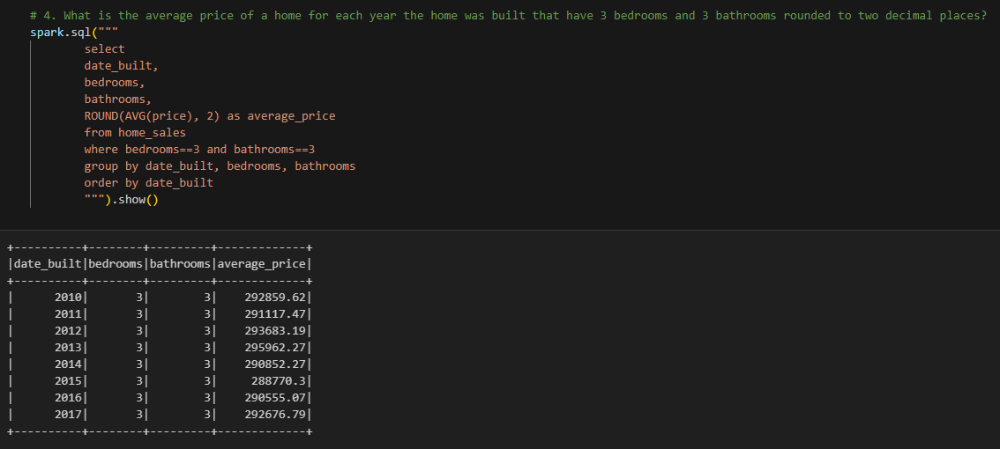

# Module 22 Big Data 

## Home Sales Data Challenge
For this challenge, I used my knowledge of ***Spark SQL*** to ascertain key metrics of home sales data by building various queries. Also using traditional Spark functions such as creating temporary views, partitioning the data, caching the data and uncaching the data to test how these processing affect run time for the queries.

## Table of Contents

 
- [About & Process](#about--process)
- [Getting Started & Installing](#getting-started--installing)
- [Resources](#resources)
- [Contributing](#contributing)

## About & Process
To begin this project I began by importing the required dependencies, such as: `findspark`,  `pyspark.sql`, `pyspark` and finally `time`. Afterwards I read in the **Home Sales Data** which was held in an **AWS-S3 bucket** the following way:  
1. First setting the url to the location of the S3 bucket
2. Using `spark.sparkContext.addFile(url)` to add the data file to the created cluster session.
3.  Buidling the dataframe from the csv file: `spark.read.csv(SparkFiles.get('home_sales_revised.csv'), sep=',', header=True)`
Then I created a temporary view for query the data in Spark SQL. After these steps I was then ready to query the data. I built queries to determine certain housing information like the average price for a home for each year built with a certain amount of bedrooms and bathrooms. Here is a sample below:

Afterwards I began the ***Spark*** sections, first caching the data  with `spark.sql("cache table home_sales")` (home_sales being the name of the temporary view), then re-running query #6 to test the run time improvements. I also saved the data as a **parquet** file and partitioned the dataframe on the field "date_built". Then creating a temp-view of the parquet data and again re-running query #6 to test the run-time changes. The initial instance of query #6 took 1.23 seconds, the cached version took 0.83 seconds and 2.04 seconds to run and return the data. The final step was to uncache the data `spark.sql('uncache table home_sales')` and then verify that this was successful `spark.catalog.isCached('home_sales')`which returns a boolean response of True or False. In this case False, assuring that the view of the data is no longer cached. 

## Getting Started & Installing
The main installation requirement for this project is **Pyspark**
Both **Mac** and **Windows** both require **Java** to be downloaded, which can be found here [Oracle Java Download](https://www.oracle.com/java/technologies/downloads/)
* **Mac**
	* Homebrew can also install java as another option
	* For Pyspark, on the terminal run `pip install pyspark==3.4`
* **Windows** 
	*  For the Spark download see the [Apache Spark](https://spark.apache.org/downloads.html) distribution site  

The 3 remaining Spark based libraries are required on both systems and are as follows. In the anaconda prompt or terminal run:
*  Findspark ---> `conda install -c conda-forge 		findspark`
* PyArrow ---> `conda install -c conda-forge pyarrow` 
* Fastparquet ---> `conda install -c conda-forge fastparquet`

## Resources

* Module 22 - Big Data Activity Files
* [SQL Order of Operations Doc](https://www.flerlagetwins.com/2018/10/sql-part4.html)

## Contributing

Justin Butler

**Aided By:**   
* class Teacher's Assistant
* Weekly Tutoring session

